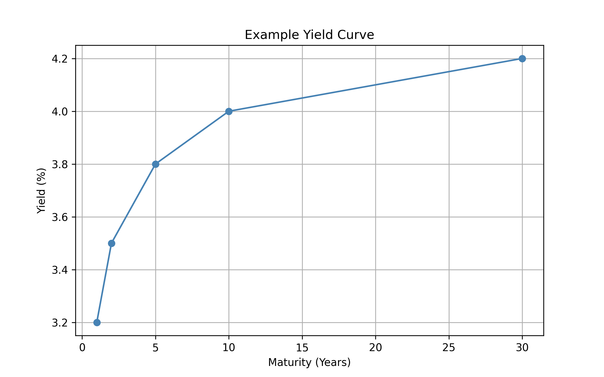

# Topic 5: Yield Curve and Term Structure

## 5.1 Yield Curve: Concept

A yield curve shows the relationship between interest rates (or bond yields) and different maturities.

### Common Shapes:
- **Normal**: Upward sloping → Economic expansion
- **Inverted**: Downward sloping → Recession signal
- **Flat**: Uncertainty or policy transitions

## 5.2 Example (Schematic)

  

<i>Figure: Hypothetical Yield Curve showing maturity vs yield</i>

## 5.3 Implications

- Spot and forward rate extraction
- Pricing fixed-income derivatives (e.g., interest rate swaps)
- Economic indicators (via yield spread, e.g., 10Y-2Y)

## 5.4 Mathematical Linkage

Forward Rate \( f_{2,3} \) from spot rates \( r_2, r_3 \):

$$
(1 + r_3)^3 = (1 + r_2)^2 \cdot (1 + f_{2,3})
$$

Solving gives forward rates used in bootstrapping, term structure modeling, and swap pricing.

> **Insight**: The yield curve encapsulates market expectations of future rates and inflation, forming the discounting backbone for derivative pricing.
