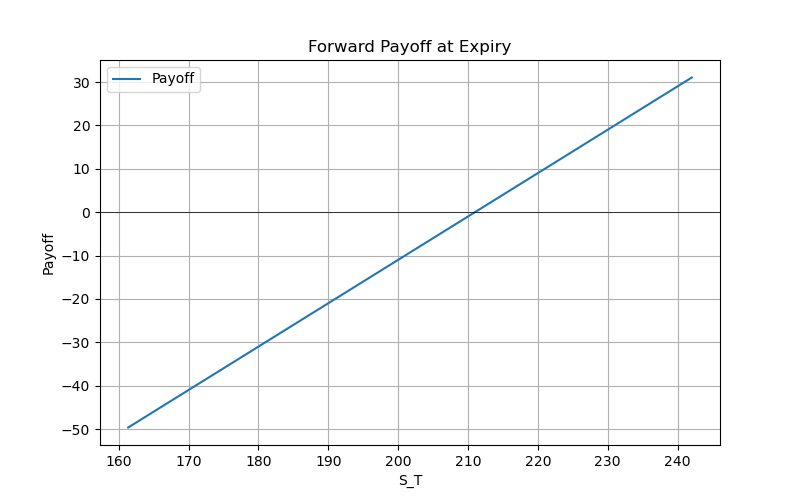

# 02. Forwards & Pricing Models

## 2.1 Overview

Forward contracts are over-the-counter agreements to buy or sell an underlying asset at a predetermined forward price $F_0$ on a specified future date $T$. They are customizable but expose parties to counterparty risk.

* **Forward Price**: Agreed-upon price $F_0$ paid at maturity.
* **Payoff at Maturity**:

$$
\text{Payoff}(S_T) = S_T - F_0
$$

* **Present Value of Profit**:

  ```math
  \text{PV Profit} = e^{-rT} \,(S_T - F_0)
  ```

## 2.2 No-Arbitrage Pricing Models

1. **Continuous Dividend Yield** (rate $q$):

$$
F_0 = S_0 \; e^{(r - q)T}
$$


3. **Discrete Dividend Adjustment** (PV of known dividends $\mathrm{PV(div)}$):

$$
F_0 = \bigl(S_0 - \mathrm{PV(div)}\bigr)\; e^{rT}
$$


## 2.3 Data Acquisition & Preprocessing

* **Data Source**: Manual CSV exports from Yahoo Finance
* **Files**: `data/AAPL.csv` (adjusted close), `data/AAPL_dividends.csv`

**Steps:**

1. Download price and dividend CSVs for the analysis period.
2. Load into pandas and align on business-day frequency:

   ```python
   import pandas as pd
   spot = pd.read_csv('data/AAPL.csv', parse_dates=['Date'], index_col='Date')['Adj Close']
   divs = pd.read_csv('data/AAPL_dividends.csv', parse_dates=['Date'], index_col='Date')['Dividends']
   df = pd.DataFrame({'Spot': spot, 'Dividends': divs}).asfreq('B').ffill()
   ```

## 2.4 Implementation Details

### 2.4.1 Dividend Present Value

```python
import numpy as np
r = 0.05         # risk-free rate
end = '2025-05-31'
days = (pd.to_datetime(df.index) - pd.to_datetime(end)).days
pv_divs = (df['Dividends'] * np.exp(-r * days/365)).sum()
print('PV(dividends):', round(pv_divs,2))
```

### 2.4.2 Forward Price Computation

```python
S0 = df['Spot'].iloc[-1]
T = 0.5          # 6 months in years
q = df['Dividends'].sum() / S0
F_cont = S0 * np.exp((r - q) * T)
F_disc = (S0 - pv_divs) * np.exp(r * T)
print(f'F_cont: {F_cont:.2f}, F_disc: {F_disc:.2f}')
```

### 2.4.3 Scenario Analysis & Payoff Table

```python
scenarios = {'Down 10%': 0.9*S0, 'Base': S0, 'Up 10%': 1.1*S0}
rows = []
for name, ST in scenarios.items():
    payoff = ST - F_cont
    pv_profit = np.exp(-r * T) * payoff
    rows.append({'Scenario': name, 'S_T': ST, 'Payoff': payoff, 'PV Profit': pv_profit})
payoff_df = pd.DataFrame(rows)
payoff_df.to_csv('assets/forward_payoff_table.csv')
```

**Output Table:**


### 2.4.4 Arbitrage Strategy

```python
F_mkt = 155.00
if F_mkt > F_cont:
    strategy = 'Cash-and-carry: buy spot, finance, short forward'
else:
    strategy = 'Reverse carry: short spot, invest proceeds, long forward'
print('Strategy:', strategy)
```

### 2.4.5 Payoff Visualization

```python
import matplotlib.pyplot as plt
ST_vals = np.linspace(0.8*S0, 1.2*S0, 100)
payoffs = ST_vals - F_cont
plt.plot(ST_vals, payoffs)
plt.axhline(0, color='black', lw=0.5)
plt.title('Forward Payoff at Expiry')
plt.xlabel('S_T')
plt.ylabel('Payoff')
plt.savefig('assets/forward_payoff_plot.png')
```



## 2.5 Self-Analysis Summary

* Reviewed theoretical pricing under both models and verified values against manual computations.
* Assessed payoff sensitivity to underlying price movements.
* Identified arbitrage conditions and documented appropriate strategies.

