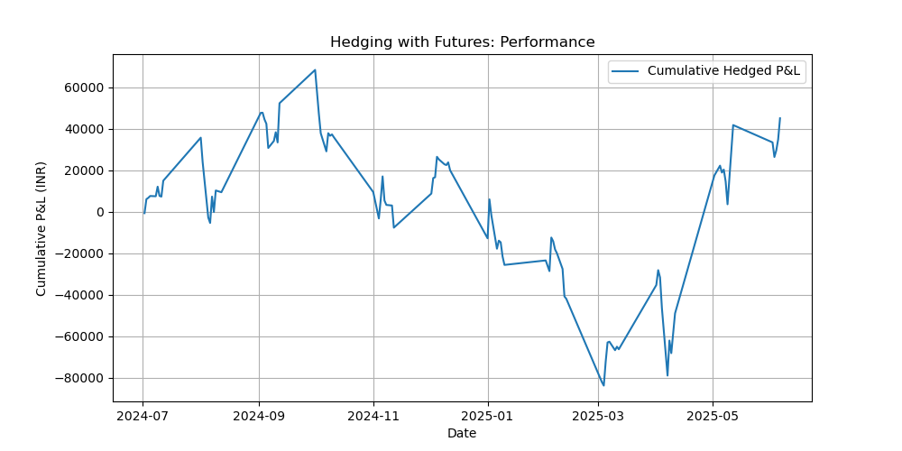

# 01. Hedging with Futures

## 1.1 Overview

Hedging with futures involves using standardized, exchange-traded contracts to protect against adverse price movements in an underlying asset. It is widely used by portfolio managers, commodity traders, and corporations to manage price risk.

* **Key Focus:**

  * Hedging equity exposure using NIFTY futures.
  * Simulating hedge performance using historical data.

---

## 1.2 Hedge Strategies

### 🔹 Short Hedge

Used to hedge a **long (owned)** position in the underlying asset against price declines.

### 🔹 Long Hedge

Used to hedge a **short (sold)** position against price increases.

---

## 1.3 Hedge Ratio Formula

The optimal hedge ratio minimizes the risk of the hedged position:

$$
h^* = \frac{\sigma_S}{\sigma_F} \rho_{SF}
$$

Where:

* $\sigma_S$ = Standard deviation of spot price changes
* $\sigma_F$ = Standard deviation of futures price changes
* $\rho_{SF}$ = Correlation between spot and futures

---

## 1.4 Data Acquisition & Preprocessing

**Data Source:** NSE India

* `data/NIFTY_spot.csv`
* `data/NIFTY_futures.csv`

```python
import pandas as pd

spot = pd.read_csv('data/NIFTY_spot.csv', parse_dates=['Date'], index_col='Date')['Close']
futures = pd.read_csv('data/NIFTY_futures.csv', parse_dates=['Date'], index_col='Date')['Close']

df = pd.DataFrame({'Spot': spot, 'Futures': futures}).dropna()
df['Spot_Returns'] = df['Spot'].pct_change()
df['Futures_Returns'] = df['Futures'].pct_change()
df = df.dropna()
df.head()
```

---

## 1.5 Hedge Ratio Calculation

```python
import numpy as np

sigma_S = df['Spot_Returns'].std()
sigma_F = df['Futures_Returns'].std()
rho = df['Spot_Returns'].corr(df['Futures_Returns'])

h_star = (sigma_S / sigma_F) * rho
print('Optimal Hedge Ratio:', round(h_star, 3))
```

---

## 1.6 Hedge Simulation

```python
# Assume exposure size
exposure = 1_000_000  # INR

# Futures contract size (example)
contract_size = 75

# Number of contracts
futures_position = h_star * exposure / (df['Futures'].iloc[-1] * contract_size)
print('Futures Contracts:', round(futures_position))

# Hedged P&L
df['Hedged_PnL'] = exposure * df['Spot_Returns'] - futures_position * contract_size * df['Futures_Returns']
df['Cumulative_Hedged_PnL'] = df['Hedged_PnL'].cumsum()
```

---

## 1.7 Hedge Performance Visualization

```python
import matplotlib.pyplot as plt

plt.figure(figsize=(10,5))
plt.plot(df.index, df['Cumulative_Hedged_PnL'], label='Cumulative Hedged P&L')
plt.title('Hedging with Futures: Performance')
plt.xlabel('Date')
plt.ylabel('Cumulative P&L (INR)')
plt.legend()
plt.savefig('assets/futures_hedge_performance.png')
plt.show()
```



---

## 1.8 Self-Analysis Summary

* Calculated optimal hedge ratio using historical spot and futures data.
* Simulated a futures-based hedge to track profit and loss over time.
* Visualized hedge effectiveness and residual risk.
* Observed that the hedge ratio is not always perfect due to **basis risk** and **market volatility.**

---

## 1.9 Resources

* **Video:** [Hedging with Futures | CFA Level I](https://www.youtube.com/watch?v=VuAQ9X8PTyU)
* **Video:** [Basis Risk Explained | CFA](https://www.youtube.com/watch?v=7k6nMSfHUEA)
* **Notebook:** `notebooks/futures_hedging.ipynb`

---
