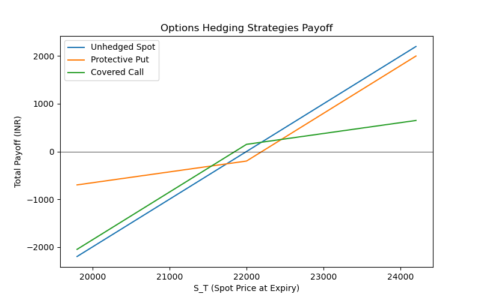

# 02. Hedging with Options

## 2.1 Overview

Options are versatile instruments used for **downside protection** or **income generation** through well-structured hedging strategies.

This section focuses on:

* **Protective Puts:** Limiting downside risk
* **Covered Calls:** Generating premium income while accepting limited upside

---

## 2.2 Hedging Strategies

### 🔹 Protective Put

* Buy the underlying asset.
* Buy a put option to limit downside risk.

**Payoff Structure:**

$$
\text{Total Payoff} = \max(S_T - S_0, 0) + \max(K - S_T, 0) - P
$$

Where:

* $S_0$ = Initial asset price
* $K$ = Put strike price
* $P$ = Premium paid

---

### 🔹 Covered Call

* Buy the underlying asset.
* Sell a call option to generate income.

**Payoff Structure:**

$$
\text{Total Payoff} = \max(S_T - S_0, 0) - \max(S_T - K, 0) + C
$$

Where:

* $C$ = Premium received for selling the call

---

## 2.3 Data & Parameters

* **Assume hypothetical options data:**

  * Initial spot price: ₹22,000
  * Put strike: ₹21,500, Premium: ₹200
  * Call strike: ₹22,500, Premium: ₹150
* Build scenarios: Down 10%, Flat, Up 10%

---

## 2.4 Protective Put Simulation

```python
import numpy as np
import pandas as pd

# Parameters
S0 = 22000
K_put = 21500
premium_put = 200

# Scenarios
ST = np.array([19800, 22000, 24200])
spot_change = ST - S0
put_payoff = np.maximum(K_put - ST, 0)
total_payoff = spot_change + put_payoff - premium_put

df_put = pd.DataFrame({'Scenario': ['Down', 'Flat', 'Up'],
                       'S_T': ST,
                       'Spot Change': spot_change,
                       'Put Payoff': put_payoff,
                       'Total Payoff': total_payoff})
df_put.to_csv('assets/protective_put_table.csv')
df_put
```

---

## 2.5 Covered Call Simulation

```python
# Parameters
K_call = 22500
premium_call = 150

# Scenarios
call_payoff = -np.maximum(ST - K_call, 0)
total_payoff = spot_change + call_payoff + premium_call

df_call = pd.DataFrame({'Scenario': ['Down', 'Flat', 'Up'],
                        'S_T': ST,
                        'Spot Change': spot_change,
                        'Call Payoff': call_payoff,
                        'Total Payoff': total_payoff})
df_call.to_csv('assets/covered_call_table.csv')
df_call
```

---

## 2.6 Visualization Example

```python
import matplotlib.pyplot as plt

plt.figure(figsize=(8,5))
plt.plot(ST, spot_change, label='Unhedged Spot')
plt.plot(ST, df_put['Total Payoff'], label='Protective Put')
plt.plot(ST, df_call['Total Payoff'], label='Covered Call')
plt.title('Options Hedging Strategies Payoff')
plt.xlabel('S_T (Spot Price at Expiry)')
plt.ylabel('Total Payoff (INR)')
plt.legend()
plt.savefig('assets/options_hedging_payoff.png')
plt.show()
```



---

## 2.7 Self-Analysis Summary

* Protective puts provide **limited downside** with a premium cost.
* Covered calls provide **limited upside** in exchange for premium income.
* Options hedging is **more flexible but more expensive** than futures hedging.
* Both strategies depend heavily on the chosen strike price and premium cost.

---

## 2.8 Resources

* **Video:** [Option Hedging Basics | CFA Level I](https://www.youtube.com/watch?v=zJKp44Aokgs)
* **Video:** [Protective Puts & Covered Calls | CFA Level I](https://www.youtube.com/watch?v=GlNCLk1B7DI)
* **Notebook:** `notebooks/options_hedging.ipynb`

---
