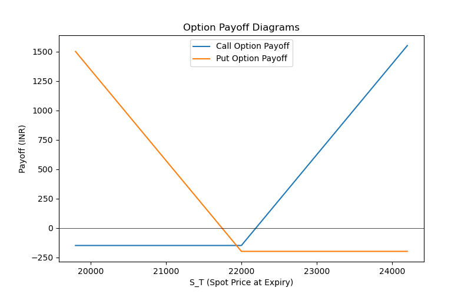
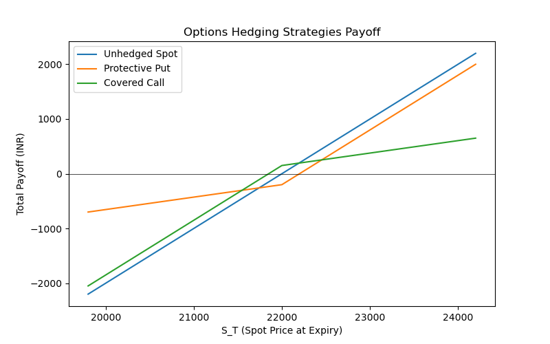

# 02. Options: Basics, Payoffs, and Basic Hedging Strategies

## 2.1 Overview

Options are financial instruments that provide the **right, but not the obligation** to buy or sell an underlying asset at a specified strike price on or before expiry.

This section covers:

* **Options Payoff Basics**
* **Option Moneyness**
* **Protective Puts** and **Covered Calls** as basic risk management strategies.

---

## 2.2 Option Types

### 🔹 Call Option

* Right to **buy** the asset at the strike price.
* Payoff:

  $$
  \text{Call Payoff} = \max(S_T - K, 0)
  $$

### 🔹 Put Option

* Right to **sell** the asset at the strike price.
* Payoff:

$$
\text{Put Payoff} = \max(K - S_T, 0)
$$


Where:

* $S_T$ = Spot price at expiry
* $K$ = Strike price

---

## 2.3 Option Moneyness

| Term                   | Condition                       |
| ---------------------- | ------------------------------- |
| In-the-Money (ITM)     | Call: $S_T > K$, Put: $S_T < K$ |
| At-the-Money (ATM)     | Call/Put: $S_T = K$             |
| Out-of-the-Money (OTM) | Call: $S_T < K$, Put: $S_T > K$ |

---

## 2.4 Scenario-Based Payoff Simulation

### 🔹 Call Option Example

```python
import numpy as np
import pandas as pd

S0 = 22000
K_call = 22500
premium_call = 150

ST = np.array([19800, 22000, 24200])
call_payoff = np.maximum(ST - K_call, 0) - premium_call

df_call = pd.DataFrame({'Scenario': ['Down', 'Flat', 'Up'],
                        'S_T': ST,
                        'Call Payoff': call_payoff})
df_call.to_csv('assets/call_option_payoff_table.csv')
df_call
```

---

### 🔹 Put Option Example

```python
K_put = 21500
premium_put = 200

put_payoff = np.maximum(K_put - ST, 0) - premium_put

df_put = pd.DataFrame({'Scenario': ['Down', 'Flat', 'Up'],
                       'S_T': ST,
                       'Put Payoff': put_payoff})
df_put.to_csv('assets/put_option_payoff_table.csv')
df_put
```

---

## 2.5 Visualization of Option Payoffs

```python
import matplotlib.pyplot as plt

plt.figure(figsize=(8,5))
plt.plot(ST, call_payoff, label='Call Option Payoff')
plt.plot(ST, put_payoff, label='Put Option Payoff')
plt.axhline(0, color='black', lw=0.5)
plt.title('Option Payoff Diagrams')
plt.xlabel('S_T (Spot Price at Expiry)')
plt.ylabel('Payoff (INR)')
plt.legend()
plt.savefig('assets/option_payoff_diagrams.png')
plt.show()
```



---

## 2.6 Basic Hedging Strategies

### 🔹 Protective Put

* Long Asset + Long Put → Limits downside risk.

```python
spot_change = ST - S0
protective_put_total = spot_change + np.maximum(K_put - ST, 0) - premium_put

df_protective = pd.DataFrame({'Scenario': ['Down', 'Flat', 'Up'],
                              'S_T': ST,
                              'Total Payoff': protective_put_total})
df_protective
```

---

### 🔹 Covered Call

* Long Asset + Short Call → Generates income but limits upside.

```python
covered_call_total = spot_change - np.maximum(ST - K_call, 0) + premium_call

df_covered = pd.DataFrame({'Scenario': ['Down', 'Flat', 'Up'],
                           'S_T': ST,
                           'Total Payoff': covered_call_total})
df_covered
```

---

### 🔹 Combined Payoff Visualization

```python
plt.figure(figsize=(8,5))
plt.plot(ST, spot_change, label='Unhedged Spot')
plt.plot(ST, protective_put_total, label='Protective Put')
plt.plot(ST, covered_call_total, label='Covered Call')
plt.axhline(0, color='black', lw=0.5)
plt.title('Options Hedging Strategies Payoff')
plt.xlabel('S_T (Spot Price at Expiry)')
plt.ylabel('Total Payoff (INR)')
plt.legend()
plt.savefig('assets/options_hedging_payoff.png')
plt.show()
```



---

## 2.7 Self-Analysis Summary

* Built **scenario-based simulations** for call and put options.
* Practiced **Protective Put** and **Covered Call** strategy modeling.
* Visualized option and hedging payoffs.
* Identified **risk-reward trade-offs** between paying premium (put) and collecting premium (call).

---

## 2.8 Resources

* **Video:** [Option Basics | CFA Level I](https://www.youtube.com/watch?v=zJKp44Aokgs)
* **Video:** [Protective Puts & Covered Calls | CFA Level I](https://www.youtube.com/watch?v=GlNCLk1B7DI)
* **Notebook:** `notebooks/options.ipynb`

---
